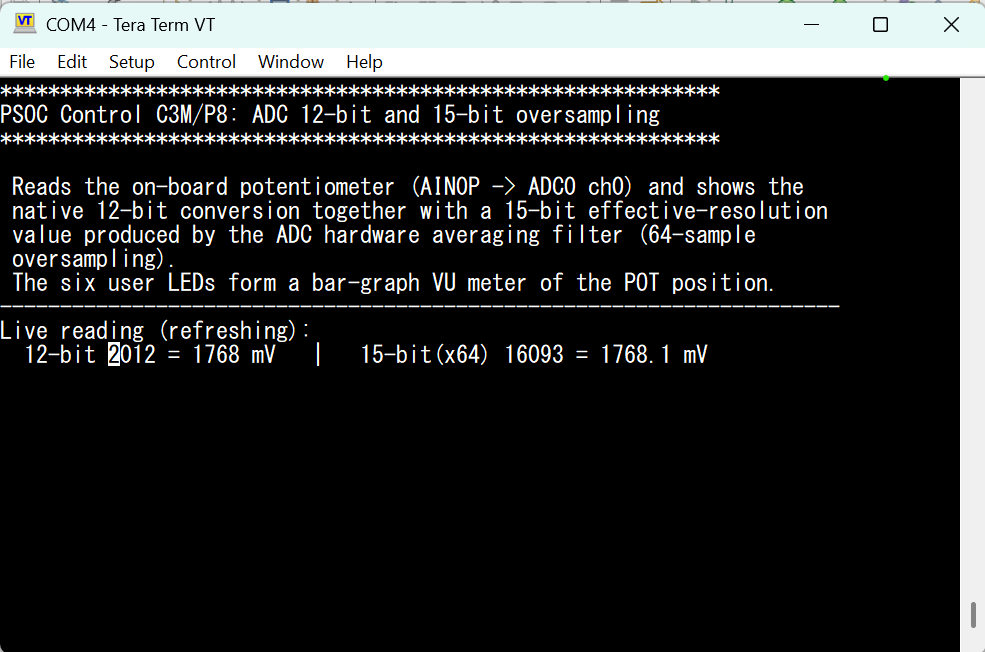

# PSOC&trade; Control C3M/P8: ADC 12-bit and 15-bit oversampling

This code example applies for PSOC&trade; Control C3M/P8 MCUs. It demonstrates the PPCA SAR ADC reading the on-board potentiometer (`AIN0P` &rarr; ADC Group 0, Channel 0) and prints, side by side, the native **12-bit** conversion and a **15-bit** effective-resolution reading produced by the ADC's **hardware averaging filter** (64x oversampling).

The analog reference (AREF), the SAR ADC (**arbitrary** trigger mode), the **averaging filter**, and the **TCPWM + EPU** trigger path are all configured in the **Device Configurator** (`bsps/TARGET_KIT_PSC3M8_EVK/config/design.modus`). The generated code is applied by `cybsp_init()` and driven from `main_cm33_s/main.c`.

**Oversampling (hardware):** the MCU's SAR ADC has a dedicated hardware digital **averaging filter** that supports up to **64x oversampling &rarr; 15-bit effective resolution** on up to six channels. Accumulating `4^K` samples adds `K` bits, so 64 (= 4³) samples give 3 extra bits: 12-bit &rarr; 15-bit. The filter accumulates the samples entirely in hardware &mdash; there is **no software accumulation loop**.

**How the filter is fed &mdash; why TCPWM + EPU?** The averaging filter only accumulates samples that arrive on the ADC **Start-Of-Conversion (`adc_soc`)** hardware signal; software/manual/auto triggering does not feed it. So the demo uses a **TCPWM** timer to generate a periodic trigger, and the **EPU** trigger fabric routes it to `adc_soc`:

```
TCPWM (POT_ADC_TRIG_PWM) --tr_out0--> EPU PU (POT_ADC_TRIG_PU) --> EPU combiner (POT_ADC_TRIG) --> ADC adc_soc[0]
```

The ADC (in **arbitrary** trigger mode) converts the POT channel on every trigger, and each conversion flows into the averaging filter. The TCPWM trigger period (~100 &micro;s here) is set long enough for the high-impedance 500&nbsp;K&Omega; pot to settle. The firmware issues a Start-Of-Filter, waits for the samples, and reads the accumulated sum. The filter uses a **signed** data path: the 12-bit data is placed in bits `[15:4]` of the 16-bit input and the midpoint is subtracted, so each accumulated sample is `(raw12 << 4) - 32768`. The firmware recovers the unsigned 15-bit value from the signed sum and the actual sample count `n` with `15-bit = (sum + n * 32768) / (2 * n)` (equivalent to `avg(raw12) * 8`).

**Why that formula &mdash; a worked example.** Each conversion result `raw12` (0..4095) is left-justified (`raw12 << 4`, i.e. `raw12 * 16`) and offset by the signed midpoint, so the filter accumulates `(raw12 << 4) - 32768` per sample. To read back an unsigned code we add the midpoint back `n` times and divide by `2 * n`; the divide-by-2 rescales the 16-bit-justified average (`raw12 * 16`) down to a 15-bit code (`raw12 * 8`). For a steady input of `raw12 = 2731` with `n = 64` samples:

```
per-sample   = (2731 << 4) - 32768 = 43696 - 32768 = 10928
sum          = 64 * 10928          = 699392
unsigned_sum = 699392 + 64 * 32768 = 2796544
val15        = 2796544 / (2 * 64)  = 21848   ( = 2731 * 8 )
voltage      = 21848 / 32767 * 3600 mV ~= 2400 mV
```

The 15-bit code `21848` represents the same ~2400 mV as the 12-bit code `2731`, but with 3 extra bits of resolution (finer steps) and far less visible noise because 64 conversions are averaged. Because the math divides by the *actual* sample count `n`, it stays correct even if a window ends early (e.g. on the safety timeout).

**Timing:** a 15-bit result needs 64 hardware-triggered conversions to accumulate in the filter (~6.4&nbsp;ms at the ~100&nbsp;&micro;s trigger period), while a 12-bit result is just the latest single conversion read straight from the ADC data register.

The demo runs entirely on the main CM33 secure core (the two PPCA cores are left idle). Turn the potentiometer and watch the 15-bit column track finer voltage steps with far more stable least-significant digits. The **six user LEDs** (`LED1`..`LED6`) form a bar-graph "VU meter" of the POT position.

## ADC oversampling on PSOC&trade; Control C3 &mdash; capabilities and options

The ATOP subsystem's SAR ADC has a built-in chain of digital filters (median, linear interpolation, low-pass, third-order CIC, and a configurable **averaging** filter, plus min/max detection). Per the architecture TRM it supports **up to 64x oversampling for 15-bit effective resolution on up to six channels**. This example uses the **averaging filter** for oversampling, which is the intended hardware path for this use case.

Ways to increase effective resolution on this MCU:

| Approach | How | Notes |
|---|---|---|
| **Averaging filter** (used here) | ADC_FILT AVG stage sums N consecutive conversions | True hardware oversampling; 4^K samples &rarr; +K bits (64 &rarr; +3 bits &rarr; 15-bit). Needs a hardware conversion stream (see below). |
| **CIC (comb) filter** | ADC_FILT CIC3 stage with a decimation factor | Also in hardware; better for higher decimation / continuous streaming with a dedicated data path. |
| **Software accumulation** | Firmware sums many `Read_ADC_Data()` results and shifts | Simplest; no filter/trigger setup, but uses CPU cycles and is not the dedicated hardware path. |

**Are we doing it correctly?** Yes &mdash; the objective was to use the MCU's hardware oversampling capability, and this example drives the on-chip **averaging filter** (configured in the Device Configurator) rather than accumulating in software. The filter is fed by hardware-triggered conversions, and the firmware only reads the finished result.

[View this README on GitHub.](https://github.com/Infineon/mtb-example-ce243360-adc-oversampling)

[Provide feedback on this code example.](https://yourvoice.infineon.com/jfe/form/SV_1NTns53sK2yiljn?Q_EED=eyJVbmlxdWUgRG9jIElkIjoiQ0UyNDMzNjAiLCJTcGVjIE51bWJlciI6IjAwMi00MzM2MCIsIkRvYyBUaXRsZSI6IlBTT0MmdHJhZGU7IENvbnRyb2wgQzNNL1A4OiBBREMgMTItYml0IGFuZCAxNS1iaXQgb3ZlcnNhbXBsaW5nIiwicmlkIjoiZGVlcGFrLnNoYXJtYUBpbmZpbmVvbi5jb20iLCJEb2MgdmVyc2lvbiI6IjEuMC4wIiwiRG9jIExhbmd1YWdlIjoiRW5nbGlzaCIsIkRvYyBEaXZpc2lvbiI6Ik1DRCIsIkRvYyBCVSI6IklDVyIsIkRvYyBGYW1pbHkiOiJQU09DIn0=)

## Requirements

- [ModusToolbox&trade;](https://www.infineon.com/modustoolbox) v3.9.0 or later (tested with v3.9.0)
- Board support package (BSP) minimum required version for:
   - KIT_PSC3M8_EVK: v2.2.0
- Programming language: C
- Associated parts: All [PSOC&trade; Control C3M/P8 MCU](https://www.infineon.com/products/microcontroller/32-bit-psoc-arm-cortex/32-bit-psoc-control-arm-cortex-m33-mcu/psoc-control-c3-performance-line) parts


## Supported toolchains (make variable 'TOOLCHAIN')

- GNU Arm&reg; Embedded Compiler v14.2.1 (`GCC_ARM`) – Default value of `TOOLCHAIN`
- Arm&reg; Compiler v6.22 (`ARM`)
- IAR C/C++ Compiler v9.70.4 (`IAR`)


## Supported kits (make variable 'TARGET')

- [PSOC&trade; Control C3M8 Evaluation Kit](https://www.infineon.com/KIT_PSC3M8_EVK) (`KIT_PSC3M8_EVK`) – Default value of `TARGET`

## Hardware setup

This example is for the PSOC&trade; Control C3M/P8 evaluation board (`KIT_PSC3M8_EVK`). No jumper-wire setup is required &mdash; it reads the on-board potentiometer directly:
- `AIN0P` &larr; on-board potentiometer (ADC Group 0, Channel 0)

Connect the kit's KitProg3 USB port to the PC and open a serial terminal at **115200-8-N-1** to view the output.

## Operation

1. Connect the board, program it, and open a serial terminal (115200-8-N-1).
2. On reset the terminal prints the banner and then a live, refreshing reading. Turn the potentiometer:
   - the **15-bit** column resolves finer voltage steps and its least-significant digits are far more stable than the raw **12-bit** column.
3. The six user LEDs (`LED1`..`LED6`) light up progressively as a bar-graph VU meter as the potentiometer is turned up.

Example terminal output:

```
======================================================================
 PSOC(TM) Control C3M8 : SAR ADC - 12-bit and 15-bit oversampling
======================================================================
 Reads the on-board potentiometer (AIN0P -> ADC0 ch0) and shows the
 native 12-bit conversion together with a 15-bit effective-resolution
 value produced by the ADC hardware averaging filter (64-sample
 oversampling).
 The six user LEDs form a bar-graph VU meter of the POT position.
----------------------------------------------------------------------
Live reading (refreshing):
  12-bit 2731 = 2402 mV   |   15-bit(x64) 21856 = 2402.3 mV
```

### About the timing

Conversions are triggered in hardware by the TCPWM timer at a fixed period (~100&nbsp;&micro;s here, set by the PWM `Period0` and the 200&nbsp;MHz PPCA timer clock). That period is intentionally long so the ADC's sampling capacitor fully charges from the high-impedance 500&nbsp;K&Omega; potentiometer. Each 15-bit result is one **hardware averaging window** of 64 triggered conversions, so it takes ~64 &times; the trigger period (~6.4&nbsp;ms), whereas a 12-bit reading is available immediately from the ADC data register. You can raise the trigger rate by lowering the PWM `Period0` in the Device Configurator &mdash; but keep it long enough for the pot to settle.


## Software setup

See the [ModusToolbox&trade; tools package installation guide](https://www.infineon.com/ModusToolboxInstallguide) for information about installing and configuring the tools package.

Install a terminal emulator if you do not have one. Instructions in this document use [Tera Term](https://teratermproject.github.io/index-en.html).

This example requires no additional software or tools.


## Using the code example


### Create the project

The ModusToolbox&trade; tools package provides the Project Creator as both a GUI tool and a command line tool.

<details><summary><b>Use Project Creator GUI</b></summary>

1. Open the Project Creator GUI tool

   There are several ways to do this, including launching it from the dashboard or from inside the Eclipse IDE. For more details, see the [Project Creator user guide](https://www.infineon.com/ModusToolboxProjectCreator) (locally available at *{ModusToolbox&trade; install directory}/tools_{version}/project-creator/docs/project-creator.pdf*)

2. On the **Choose Board Support Package (BSP)** page, select a kit supported by this code example. See [Supported kits](#supported-kits-make-variable-target)

   > **Note:** To use this code example for a kit not listed here, you may need to update the source files. If the kit does not have the required resources, the application may not work

3. On the **Select Application** page:

   a. Select the **Applications(s) Root Path** and the **Target IDE**

      > **Note:** Depending on how you open the Project Creator tool, these fields may be pre-selected for you

   b. Select this code example from the list by enabling its check box

      > **Note:** You can narrow the list of displayed examples by typing in the filter box

   c. (Optional) Change the suggested **New Application Name** and **New BSP Name**

   d. Click **Create** to complete the application creation process

</details>


<details><summary><b>Use Project Creator CLI</b></summary>

The 'project-creator-cli' tool can be used to create applications from a CLI terminal or from within batch files or shell scripts. This tool is available in the *{ModusToolbox&trade; install directory}/tools_{version}/project-creator/* directory.

Use a CLI terminal to invoke the 'project-creator-cli' tool. On Windows, use the command-line 'modus-shell' program provided in the ModusToolbox&trade; installation instead of a standard Windows command-line application. This shell provides access to all ModusToolbox&trade; tools. You can access it by typing "modus-shell" in the search box in the Windows menu. In Linux and macOS, you can use any terminal application.

The following example clones the "[mtb-example-ce243360-adc-oversampling](https://github.com/Infineon/mtb-example-ce243360-adc-oversampling)" application with the desired name "AdcOversampling" configured for the *KIT_PSC3M8_EVK* BSP into the specified working directory, *C:/mtb_projects*:

   ```
   project-creator-cli --board-id KIT_PSC3M8_EVK --app-id mtb-example-ce243360-adc-oversampling --user-app-name AdcOversampling --target-dir "C:/mtb_projects"
   ```

The 'project-creator-cli' tool has the following arguments:

Argument | Description | Required/optional
---------|-------------|-----------
`--board-id` | Defined in the <id> field of the [BSP](https://github.com/Infineon?q=bsp-manifest&type=&language=&sort=) manifest | Required
`--app-id`   | Defined in the <id> field of the [CE](https://github.com/Infineon?q=ce-manifest&type=&language=&sort=) manifest | Required
`--target-dir`| Specify the directory in which the application is to be created if you prefer not to use the default current working directory | Optional
`--user-app-name`| Specify the name of the application if you prefer to have a name other than the example's default name | Optional

<br>

> **Note:** The project-creator-cli tool uses the `git clone` and `make getlibs` commands to fetch the repository and import the required libraries. For details, see the "Project creator tools" section of the [ModusToolbox&trade; tools package user guide](https://www.infineon.com/ModusToolboxUserGuide) (locally available at {ModusToolbox&trade; install directory}/docs_{version}/mtb_user_guide.pdf).

</details>


### Open the project

After the project has been created, you can open it in your preferred development environment.


<details><summary><b>Eclipse IDE</b></summary>

If you opened the Project Creator tool from the included Eclipse IDE, the project will open in Eclipse automatically.

For more details, see the [Eclipse IDE for ModusToolbox&trade; user guide](https://www.infineon.com/MTBEclipseIDEUserGuide) (locally available at *{ModusToolbox&trade; install directory}/docs_{version}/mt_ide_user_guide.pdf*).

</details>


<details><summary><b>Visual Studio (VS) Code</b></summary>

Launch VS Code manually, and then open the generated *{project-name}.code-workspace* file located in the project directory.

For more details, see the [Visual Studio Code for ModusToolbox&trade; user guide](https://www.infineon.com/MTBVSCodeUserGuide) (locally available at *{ModusToolbox&trade; install directory}/docs_{version}/mt_vscode_user_guide.pdf*).

</details>


<details><summary><b>Command line</b></summary>

If you prefer to use the CLI, open the appropriate terminal, and navigate to the project directory. On Windows, use the command-line 'modus-shell' program; on Linux and macOS, you can use any terminal application. From there, you can run various `make` commands.

For more details, see the [ModusToolbox&trade; tools package user guide](https://www.infineon.com/ModusToolboxUserGuide) (locally available at *{ModusToolbox&trade; install directory}/docs_{version}/mtb_user_guide.pdf*).

</details>


## Operation

1. Connect the board to your PC using the provided USB cable through the KitProg3 USB connector

2. Open a terminal program and select the KitProg3 COM port. Set the serial port parameters to 8N1 and 115200 baud

3. Program the board using one of the following:

   <details><summary><b>Using Eclipse IDE</b></summary>

      1. Select the application project in the Project Explorer

      2. In the **Quick Panel**, scroll down, and click **\<Application Name> Program (KitProg3_MiniProg4)**
   </details>


   <details><summary><b>In other IDEs</b></summary>

   Follow the instructions in your preferred IDE.

   </details>


   <details><summary><b>Using CLI</b></summary>

     From the terminal, execute the `make program` command to build and program the application using the default toolchain to the default target. The default toolchain is specified in the application's Makefile but you can override this value manually:
      ```
      make program TOOLCHAIN=<toolchain>
      ```

      Example:
      ```
      make program TOOLCHAIN=GCC_ARM
      ```
   </details>

4. After programming, the application starts automatically. Confirm that the banner "PSOC(TM) Control C3M8 : SAR ADC - 12-bit and 15-bit oversampling" is displayed on the UART terminal, followed by a live, refreshing reading.

   **Figure 1. Terminal output on program startup**

   

5. Turn the on-board potentiometer and observe:
   - the **12-bit** and **15-bit** columns both track the voltage, but the 15-bit column resolves finer steps and its least-significant digits are far more stable
   - the six user LEDs (`LED1`..`LED6`) light up progressively as a bar-graph VU meter following the potentiometer position

6. Monitor the UART terminal to watch the live reading update as the potentiometer is turned.


## Debugging

You can debug the example to step through the code.


<details><summary><b>In Eclipse IDE</b></summary>

Use the **\<Application Name> Debug (KitProg3_MiniProg4)** configuration in the **Quick Panel**. For details, see the "Program and debug" section in the [Eclipse IDE for ModusToolbox&trade; user guide](https://www.infineon.com/MTBEclipseIDEUserGuide).

</details>


<details><summary><b>In other IDEs</b></summary>

Follow the instructions in your preferred IDE.

</details>


## Design and implementation

### Overview

The example runs entirely on the **main CM33 secure core**; the two PPCA cores are left idle. All analog resources are configured in the Device Configurator and applied by `cybsp_init()`. Because the PPCA block holds its registers in reset while it is disabled, `main()` **re-applies** the generated AREF / ADC / averaging-filter / EPU configuration *after* `Cy_PPCA_Enable()`, then starts the TCPWM trigger.

### Signal chain

```
POT (AIN0P) --> SAR ADC Group 0, Ch 0 --> ADC data register        --> 12-bit read
                                       \-> averaging filter (64x)   --> 15-bit read

TCPWM (POT_ADC_TRIG_PWM) --tr_out0--> EPU PU --> EPU combiner --> ADC adc_soc[0]
```

- **12-bit path:** `adc_read_12bit()` returns the latest single conversion straight from the ADC data register.
- **15-bit path:** `adc_read_15bit()` starts a fresh averaging window, waits (bounded) for 64 hardware-triggered conversions to accumulate, reads the signed sum and the actual sample count `n`, and normalizes to a 15-bit code with `(sum + n * 32768) / (2 * n)` (see the worked example above).
- **Trigger path:** a TCPWM timer generates a periodic trigger that the EPU routes to the ADC Start-Of-Conversion input, so conversions run continuously and feed the filter without CPU involvement.
- **VU meter:** `update_vu_leds()` lights `LED1`..`LED6` proportionally to the 12-bit reading.

### Resources and settings

The application uses the UART to print messages on the UART terminal. The UART resource initialization and retargeting of standard I/O to the UART port is performed using the [retarget-io](https://github.com/Infineon/retarget-io) library.

**Table 1. Application resources**

Resource  |  Alias/object     |    Purpose
:-------- | :-------------    | :------------
 UART (HAL) | DEBUG_UART_hal_obj | UART HAL object used by Retarget-IO for debug messages
 ADC (PDL)  | POT_ADC            | SAR ADC Group 0, Channel 0 &mdash; reads the on-board potentiometer (`AIN0P`)
 ADC filter (PDL) | POT_ADC_FILTER | Hardware averaging filter (64x oversampling &rarr; 15-bit)
 AREF (PDL) | POT_AREF           | Analog reference for the SAR ADC
 TCPWM (PDL) | POT_ADC_TRIG_PWM  | Periodic timer that hardware-triggers ADC conversions
 EPU (PDL)  | POT_ADC_TRIG / POT_ADC_TRIG_PU | Routes the TCPWM trigger to the ADC `adc_soc` input
 GPIO (PDL) | CYBSP_USER_LED1..LED6 | Bar-graph VU meter of the potentiometer position


<br>


## Related resources

Resources  | Links
-----------|----------------------------------
Code examples  | [Using ModusToolbox&trade;](https://github.com/Infineon/Code-Examples-for-ModusToolbox-Software) on GitHub
Device documentation | [PSOC&trade; Control C3M/P8 MCU documents](https://www.infineon.com/products/microcontroller/32-bit-psoc-arm-cortex/32-bit-psoc-control-arm-cortex-m33-mcu/psoc-control-c3-performance-line?ftab=01#Documents)
Development kits | Select your kits from the [Evaluation board finder](https://www.infineon.com/cms/en/design-support/finder-selection-tools/product-finder/evaluation-board)
Libraries on GitHub  | [mtb-dsl-psc3m8](https://github.com/Infineon/mtb-dsl-psc3m8) – Device Support Library (DSL) <br> [retarget-io](https://github.com/Infineon/retarget-io) – Utility library to retarget STDIO messages to a UART port
Tools  | [ModusToolbox&trade;](https://www.infineon.com/modustoolbox) – ModusToolbox&trade; software is a collection of easy-to-use libraries and tools enabling rapid development with Infineon MCUs for applications ranging from wireless and cloud-connected systems, edge AI/ML, embedded sense and control, to wired USB connectivity using PSOC&trade; Industrial/IoT MCUs, AIROC&trade; Wi-Fi and Bluetooth&reg; connectivity devices, XMC&trade; Industrial MCUs, and EZ-USB&trade;/EZ-PD&trade; wired connectivity controllers. ModusToolbox&trade; incorporates a comprehensive set of BSPs, HAL, libraries, configuration tools, and provides support for industry-standard IDEs to fast-track your embedded application development

<br>


## Other resources

Infineon provides a wealth of data at [www.infineon.com](https://www.infineon.com) to help you select the right device, and quickly and effectively integrate it into your design.


## Document history

Document title: *CE243360* – *PSOC&trade; Control C3M/P8: ADC 12-bit and 15-bit oversampling*

 Version | Description of change
 ------- | ---------------------
 1.0.0   | New code example
<br>


All referenced product or service names and trademarks are the property of their respective owners.

The Bluetooth&reg; word mark and logos are registered trademarks owned by Bluetooth SIG, Inc., and any use of such marks by Infineon is under license.

PSOC&trade;, formerly known as PSoC&trade;, is a trademark of Infineon Technologies. Any references to PSoC&trade; in this document or others shall be deemed to refer to PSOC&trade;.

---------------------------------------------------------

(c) 2024-2026, Infineon Technologies AG, or an affiliate of Infineon Technologies AG. All rights reserved.
This software, associated documentation and materials ("Software") is owned by Infineon Technologies AG or one of its affiliates ("Infineon") and is protected by and subject to worldwide patent protection, worldwide copyright laws, and international treaty provisions. Therefore, you may use this Software only as provided in the license agreement accompanying the software package from which you obtained this Software. If no license agreement applies, then any use, reproduction, modification, translation, or compilation of this Software is prohibited without the express written permission of Infineon.
<br>
Disclaimer: UNLESS OTHERWISE EXPRESSLY AGREED WITH INFINEON, THIS SOFTWARE IS PROVIDED AS-IS, WITH NO WARRANTY OF ANY KIND, EXPRESS OR IMPLIED, INCLUDING, BUT NOT LIMITED TO, ALL WARRANTIES OF NON-INFRINGEMENT OF THIRD-PARTY RIGHTS AND IMPLIED WARRANTIES SUCH AS WARRANTIES OF FITNESS FOR A SPECIFIC USE/PURPOSE OR MERCHANTABILITY. Infineon reserves the right to make changes to the Software without notice. You are responsible for properly designing, programming, and testing the functionality and safety of your intended application of the Software, as well as complying with any legal requirements related to its use. Infineon does not guarantee that the Software will be free from intrusion, data theft or loss, or other breaches (“Security Breaches”), and Infineon shall have no liability arising out of any Security Breaches. Unless otherwise explicitly approved by Infineon, the Software may not be used in any application where a failure of the Product or any consequences of the use thereof can reasonably be expected to result in personal injury.
